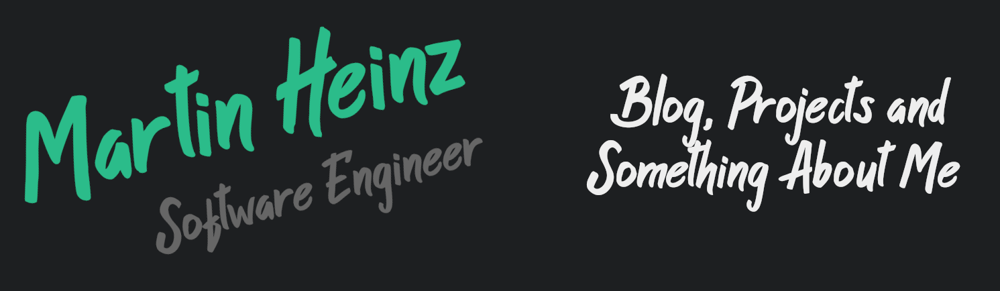

# About Me

My name is Martin Heinz and I'm a software developer/DevOps engineer. I'm from Slovakia, living in Bratislava and currently working at IBM. You can find me on [![alt text][1.2]][1],  or on [![alt text][3.2]][3].

Below, you can find some of my more popular project repositories, notably [python-project-blueprint](https://github.com/MartinHeinz/python-project-blueprint) (template for Python projects), [go-project-blueprint](https://github.com/MartinHeinz/go-project-blueprint) (template for Golang project) and [physics-visual](https://github.com/MartinHeinz/physics-visual) (2D physics visualization using Vanilla JS)

Apart from coding, I also maintain a blog - you can find my articles on my website at [martinheinz.dev](https://martinheinz.dev/) as well as on [Medium](https://medium.com/@martin.heinz) and [DEV.to](https://dev.to/martinheinz).

<!-- links to social media icons -->

<!-- icons with padding -->

[1.1]: http://i.imgur.com/tXSoThF.png (twitter icon with padding)
[2.1]: http://i.imgur.com/0o48UoR.png (github icon with padding)

<!-- icons without padding -->

[1.2]: http://i.imgur.com/wWzX9uB.png (twitter icon without padding)
[2.2]: http://i.imgur.com/9I6NRUm.png (github icon without padding)
[3.2]: ./linkedin-3-16.png (LinkedIn icon without padding)

<!-- links to your social media accounts -->
<!-- update these accordingly -->

[1]: https://twitter.com/Martin_Heinz_
[2]: https://github.com/MartinHeinz
[3]: https://www.linkedin.com/in/heinz-martin/